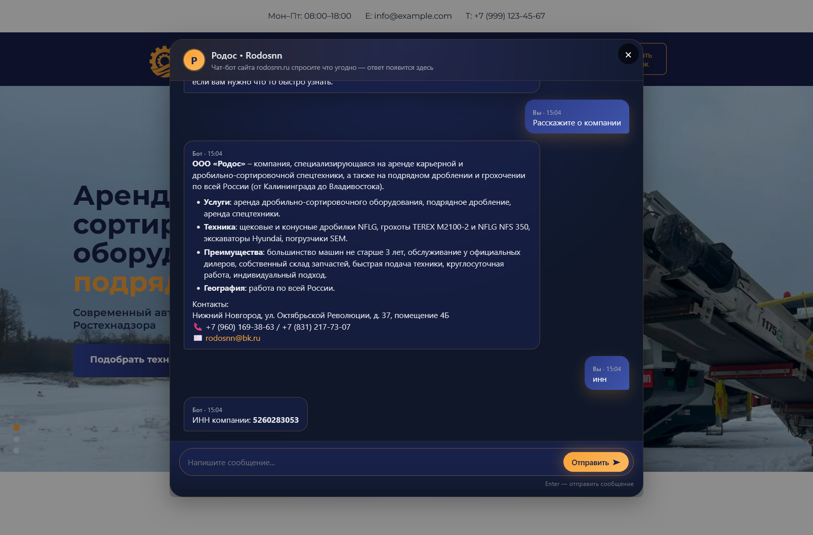
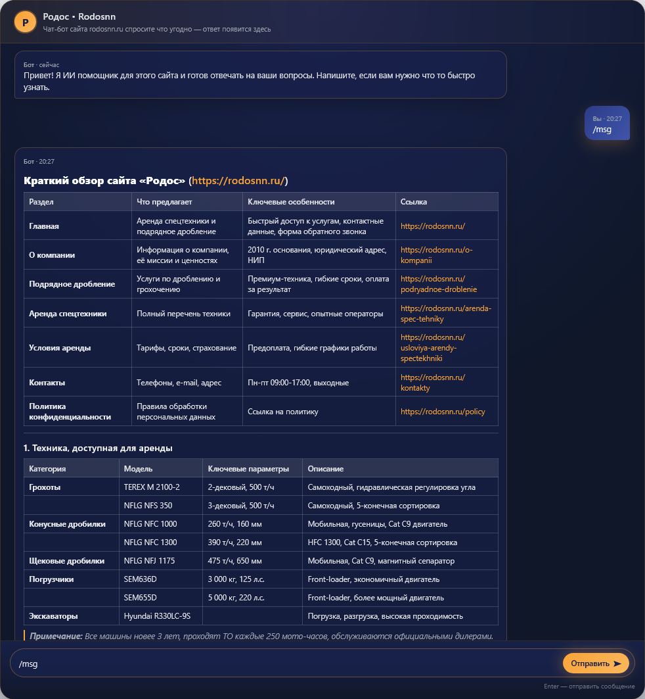
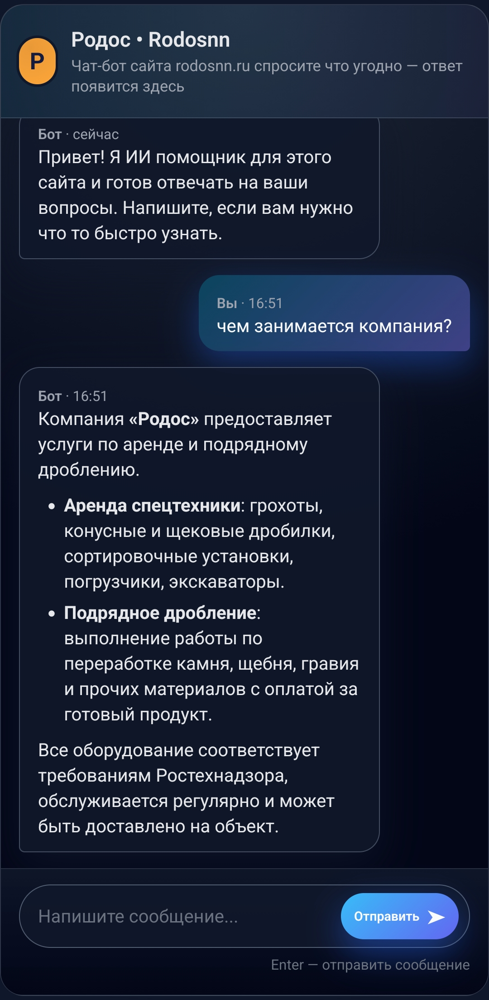

# Flask Chatbot

## Project Overview

This repository provides a Flask‑based web application that powers a chat assistant for the **Rodos** website. The bot answers visitor questions with concise, accurate responses drawn exclusively from the site’s content. It integrates OpenRouter’s API to generate replies, and includes tools for crawling the site, managing prompts, and testing the chatbot.

---

## Key Features

- **Web chat interface** – Users interact with the bot through a single‑page UI built with HTML, CSS, and JavaScript (`templates/` and `static/`).
- **OpenRouter integration** – Calls the OpenRouter API (default model: `gpt‑4o‑mini`) with temperature 0.3 and a 1000‑token limit for focused answers.
- **Site‑specific context** – The bot loads a pre‑generated text file (`SITE_CONTEXT_FILE`) that contains all relevant information from the Rodos site (services, equipment, rental terms, contacts, etc.). Responses are limited to this data only.
- **System prompt** – A custom system prompt forces the model to answer precisely, briefly, and in modest Markdown formatting.
- **Error handling** – Graceful messages for missing API keys, absent context files, or request failures.
- **Test commands** – Built‑in commands for quick verification:
  - `/msg` – Returns a detailed Markdown overview of the site (tables of services, equipment, terms, contacts).
  - `/md` – Returns a sample Markdown rendering to check front‑end display.

## Screenshots







## Project Structure

| File / Directory | Description |
|------------------|-------------|
| `main.py` | Core Flask app; routes for home (`/`), chat (`/chat`), and test (`/test`). Handles context loading, message building, and OpenRouter calls. |
| `crawler.py` | Stand‑alone script that crawls the Rodos website, extracts text and links with BeautifulSoup, and writes a structured context file. Supports depth and delay options. |
| `commands.py` | Definitions of the `/msg` and `/md` test commands. |
| `namespace.py` | Constants, environment variable names, system prompt, welcome message, and sample texts. |
| `templates/index.html` | HTML template for the chat UI. |
| `static/chat.css` / `static/chat.js` | Front‑end styling and client‑side logic. |
| `requirements.txt` | Python dependencies (Flask, requests, python‑dotenv, beautifulsoup4, etc.). |

---

## Getting Started (Only For Developer)

### 1. Install

```bash
# Create and activate a virtual environment (Python 3.8+ recommended)
python -m venv .venv
# Windows
.venv\Scripts\activate
# macOS / Linux
source .venv/bin/activate

# Install dependencies
pip install -r requirements.txt
```

### 2. Configure Environment Variables

1. Copy `.env.example` to `.env`  
2. Set the following variables:

```env
OPENROUTER_API_KEY=your_openrouter_api_key
SITE_CONTEXT_FILE=all_context.txt
OPENROUTER_API_URL=https://openrouter.ai/api/v1/chat/completions
OPENROUTER_MODEL=gpt-4o-mini
```

### 3. Generate Site Context

Run the crawler to collect all textual content from the Rodos website:

```bash
python crawler.py https://rodosnn.ru/ 2 all_context.txt
```

- `<start_url>` – Starting page (e.g., `https://rodosnn.ru/`).  
- `[max_depth]` – Crawl depth (default 2).  
- `[output_file]` – Destination file (default `output.txt`).  

Ensure the output file matches the `SITE_CONTEXT_FILE` path.

### 4. Launch the Application

```bash
python main.py
```

Open a browser and navigate to `http://127.0.0.1:5000`. The chat interface should appear, ready for interaction.

### 5. Test the Bot

- Send `/msg` in the chat to receive a full Markdown site overview.  
- Send `/md` to check Markdown rendering.  
- Ask any site‑related question to verify that responses are drawn from the provided context.

## Advanced Configuration

- **Switch AI model** – Update `OPENROUTER_MODEL` in `.env` (e.g., `anthropic/claude-3-haiku`).  
- **Edit system prompt** – Modify `MASTER_PROMPT` inside `namespace.py` to adjust bot behavior.
